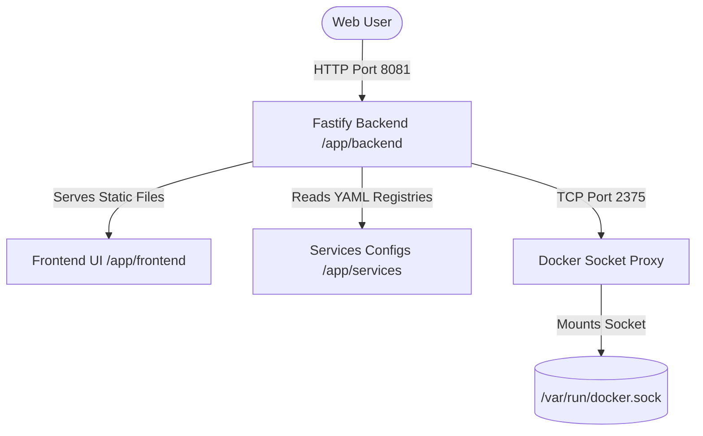

# HomeLab OS Dashboard Control Plane

This service runs the central control plane and management console for the HomeLab OS. It comprises a Fastify Node.js backend that serves the static frontend, dynamically scans local service registries, and manages Docker containers via a Socket Proxy.

## System Architecture



### 1. Docker Socket Proxy Security
To prevent direct exposure of `/var/run/docker.sock` to the web-exposed dashboard container, Tecnativa's Docker Socket Proxy is deployed as a sidecar (`homelab-docker-proxy`).
- **Enforced Security Profile:** Only `CONTAINERS`, `IMAGES`, `POST` (for container lifecycles), and `INFO` APIs are enabled. 
- Advanced capabilities (such as `EXEC`, `NETWORKS`, `VOLUMES`, `SECRETS`, `SWARM`) are disabled. The proxy is not exposed on host ports and remains private to the internal network.

### 2. Dynamic Service Discovery
The backend recursively scans the directory mapped to `/app/services`. It parses each `service.yaml` configuration file and registers it in the SQLite database automatically. Adding a new container stack requires only creating a folder with a valid `service.yaml` under `services/`.

---

## Technical Specifications

- **Exposed Host Port:** `8081` (configurable via `DASHBOARD_PORT` in `.env`)
- **Volume Mounts:**
  - `../services:/app/services:ro` - Maps host registries as read-only.
- **Internal APIs:**
  - `GET /api/v1/services` - Returns discovered services merged with container state.
  - `GET /api/v1/system` - Returns system metrics aggregated from the host.
  - `GET /api/v1/services/:id/logs` - Retrieves container stdout/stderr.
  - `POST /api/v1/services/:id/action` - Invokes container start, stop, or restart.

---

## Local Development (TypeScript Engine)

To run the backend control plane locally without Docker:
1. Verify Node.js (>= 18) is installed.
2. Install dependencies:
   ```bash
   cd dashboard/backend
   npm install
   ```
3. Compile and start the development server:
   ```bash
   npm run dev
   ```
4. Access the dashboard UI at `http://localhost:8081`.

---

## Server Deployment

To deploy the dashboard:
1. Verify the external network is created:
   ```bash
   docker network create homelab-network
   ```
2. Build and start the services stack:
   ```bash
   docker compose up -d --build
   ```
3. The dashboard is accessible at `http://[host-ip]:8081`.

---

## Technical Specifications Updates

### 1. Terminal Console Inline Prompt Layout
To maintain a high-fidelity native CLI feel, the Server Console Terminal widget has no separate input box row:
* **Input Mechanics**: Keyboard inputs are focused onto a hidden `<input>` element and mirrored in real-time in the terminal text block next to the cursor (`#w-term-input-text` and `#m-term-input-text`).
* **Auto-Focus**: Clicking anywhere inside the terminal body refocusses the hidden input automatically.
* **Auto-Scroll Behavior**: The terminal stream is equipped with smart scrolling. If the viewport is scrolled up, updates are written in the background to prevent scroll-jacking. Auto-scroll resumes once the user scrolls back to the bottom.

### 2. Exclusively Tunneled Public Latency Timing
* **Public Domain Timing**: Latency checks are executed exclusively for containers that have a public Cloudflare Tunnel URL configured (`mappedPublicDomain`). The backend attempts a real TCP connection to the domain on port `443` (falling back to `80`) to measure the actual network round-trip latency to the internet.
* **Local-Only Containers**: For local-only containers (without an ingress tunnel domain mapped), latency timing is bypassed and set to `N/A`. The frontend dynamically hides the Latency row entirely on these cards to preserve layout symmetry.
