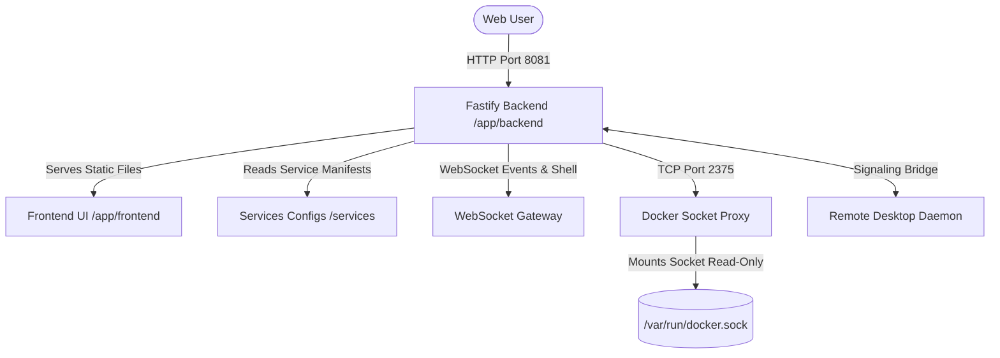

# HomeLab OS Dashboard Control Plane

The HomeLab OS Dashboard Control Plane is the central management daemon and web console for the HomeLab infrastructure. It is built as a modular Fastify TypeScript server serving a lightweight Single-Page Application (SPA) frontend, managing Docker containers via an isolated Docker Socket Proxy, and orchestrating real-time telemetry, terminal sessions, and Remote Desktop streams.

---

## 1. System Architecture


```mermaid
graph TD
    User([Web User]) -->|HTTP Port 8081| Backend[Fastify Backend /app/backend]
    Backend -->|Serves Static Files| Frontend[Frontend UI /app/frontend]
    Backend -->|Reads Service Manifests| ServicesDir[Services Configs /services]
    Backend -->|WebSocket Events & Shell| WS_Gate[WebSocket Gateway]
    Backend -->|TCP Port 2375| Proxy[Docker Socket Proxy]
    Proxy -->|Mounts Socket Read-Only| HostSocket[(/var/run/docker.sock)]
    Backend <-->|Signaling Bridge| Streamer[Remote Desktop Daemon]
```

### 1.1 Docker Socket Proxy Security
To prevent direct exposure of `/var/run/docker.sock` to the web-exposed dashboard container, Tecnativa's Docker Socket Proxy is deployed as a mandatory sidecar (`homelab-docker-proxy`):
- **Enforced Capabilities Profile:** Only `CONTAINERS`, `IMAGES`, `POST` (for start/stop/restart operations), `NETWORKS`, `VOLUMES`, and `INFO` APIs are enabled.
- **Restricted Access:** Host filesystem mounts, raw execution privileges (`EXEC`), and swarm modifications are strictly blocked at the proxy layer.
- **Private Network Isolation:** The socket proxy does not publish ports on the host and is reachable exclusively within the internal `homelab-network` Docker bridge.

### 1.2 Dynamic Service Discovery
The backend recursively scans the directory mapped to `/services`. It parses each `service.yaml` configuration file and automatically registers it in the SQLite database. Adding a new container stack requires only creating a folder with a valid `service.yaml` under `services/`.

---

## 2. Technical Specifications

- **Exposed Host Port:** `8081` (configurable via `DASHBOARD_PORT` in `.env`).
- **Internal Network:** `homelab-network` (external bridge network).
- **Database:** SQLite with Write-Ahead Logging (`WAL` mode) mounted at `/data/homelab.db`.
- **Volume Mounts:**
  - `../services:/services:ro` — Maps host service manifests as read-only.
  - `./data:/data` — Persistent database, logs, and staging storage.
  - `/proc:/host/proc:ro` — Read-only host process table for telemetry inspection.
- **Privileges:** The container runs unprivileged by default. `docker-compose.host-access.yml` is an opt-in override that adds `privileged: true`, `pid: host`, and read-only mounts of the directories where Cloudflare Tunnel configs live. It is needed only to manage the Remote Desktop daemon from the dashboard and to auto-discover tunnel configs (see section 5).

---

## 3. Real-Time WebSocket Gateways

The control plane exposes dedicated WebSocket endpoints:

| Endpoint | Subsystem | Protocol & Function |
| :--- | :--- | :--- |
| `/ws` | System Events | Streams `system.metrics`, container logs (`docker.logs.<id>`), job progress updates, and audit notifications. |
| `/ws/terminal` | Terminal Console | Multiplexes bi-directional shell I/O with remote SSH connections or host PowerShell/Bash shells. |
| `/ws/desktop` | Remote Desktop | Exchanges WebRTC SDP offers/answers and streams user input events (mouse, keyboard). |
| `/ws/desktop/daemon` | Streamer Bridge | Control channel connecting the host-side Python streamer daemon to the WebRTC signaling gateway. |

---

## 4. Local Development Setup

To run the dashboard locally for development without Docker:

### 4.1 Prerequisites
- Node.js (v20.0.0 or higher)
- npm (v9.0.0 or higher)
- Python 3.9+ (optional, for Remote Desktop streamer testing)

### 4.2 Installation & Dependency Setup
```bash
# Navigate to the backend directory
cd dashboard/backend

# Install dependencies
npm install
```

### 4.3 Environment Configuration
Create a local `.env` file in `dashboard/backend/.env`:
```env
PORT=8081
HOST=0.0.0.0
NODE_ENV=development
JWT_SECRET=your_super_secret_development_key_32_bytes_long
# Required when NODE_ENV=production; optional for local development
ENCRYPTION_KEY=your_development_encryption_key_32_bytes_long
# Optional. Hours before a session must sign in again even if it is in constant use (default 12)
# SESSION_MAX_HOURS=12
# Optional. Sites allowed to embed the dashboard in a frame (default: none)
# FRAME_ANCESTORS='self' https://home.example.com
DATABASE_PATH=./data/homelab_dev.db
DATA_DIR=./data
DOCKER_PROXY_URL=http://localhost:2375
DOCKER_HOST=tcp://localhost:2375
SERVICES_DIR=../../services
```

### 4.4 Running Development Server
```bash
# Start backend in watch mode with automatic TypeScript reloading
npm run dev
```
The dashboard interface will be accessible in your web browser at `http://localhost:8081`.

### 4.5 Testing & Code Quality
```bash
# Run ESLint validation
npm run lint

# Run automated unit and integration tests
npm run test

# Build production bundle
npm run build
```

---

## 5. Production Server Deployment

To deploy the dashboard in production using Docker Compose:

1. Create the shared external Docker network if it does not already exist:
   ```bash
   docker network create homelab-network
   ```
2. Navigate to the `dashboard/` directory:
   ```bash
   cd dashboard
   ```
3. Create the backend configuration and set its two required secrets (the container refuses to start in production without them):
   ```bash
   cp backend/.env.example backend/.env
   # Set JWT_SECRET and ENCRYPTION_KEY, e.g. with: openssl rand -hex 32
   # Behind a reverse proxy or Cloudflare Tunnel, also set TRUST_PROXY (see .env.example)
   ```
4. Build and launch the container stack:
   ```bash
   docker compose up -d --build
   ```
   To also manage the Remote Desktop daemon from the dashboard or auto-discover Cloudflare Tunnel configs, layer the host-access override on top (it grants a privileged container; read its header first):
   ```bash
   docker compose -f docker-compose.yml -f docker-compose.host-access.yml up -d --build
   ```
5. Check running logs to verify clean boot:
   ```bash
   docker compose logs -f dashboard
   ```
6. Access the administration interface at `http://<host-ip>:8081`.

WebSocket connections authenticate with a single-use ticket (`POST /api/v1/auth/ws-ticket`), not the session token; see `docs/API.md`.
