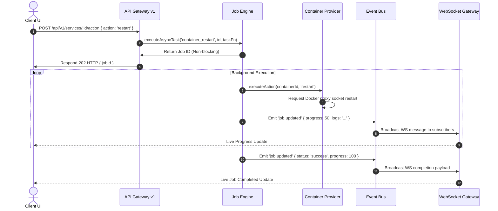

# HomeLab OS System Architecture Specification

This document details the system design, communication protocols, database schema, and runtime execution models of the HomeLab OS platform.

---

## 1. Overall System Architecture

HomeLab OS employs a decoupled client-server architecture. The backend functions as a headless control plane exposing a Fastify REST API and a WebSocket events gateway. The frontend is a vanilla single-page application (SPA) executing client-side dashboard renders.

```mermaid
graph TD
    subgraph Client-Side (Frontend SPA)
        UI[Dashboard Canvas] --> WM[Widget Manager]
        UI --> WS_C[WS Client]
        UI --> API_C[HTTP API Client]
    end

    subgraph Server-Side (Backend Daemon)
        API_C --> REST[Fastify REST Router]
        WS_C --> WS_G[WebSocket Gateway]
        
        REST --> REG[Service Registry]
        WS_G --> EB[Event Bus]
        REG --> EB
        
        REG --> DB[SQLite Adapter]
        REG --> CP[Container Provider]
        REG --> JE[Job Engine]
        REG --> SCHED[Cron Scheduler]
    end

    subgraph Host Infrastructure
        CP --> DSP[Docker Socket Proxy]
    end
    
    classDef default fill:#1e293b,stroke:#475569,stroke-width:1px,color:#fff;
```

---

## 2. Directory Structure

```
D:/My_Projects/HomeLab/
├── .github/                  # GitHub Community & Actions configurations
├── configs/                  # Shared system configuration specs
├── docs/                     # Architectural & specification documents
├── services/                 # Auto-discovered plugin packages
│   ├── portainer/
│   │   ├── service.yaml      # Plugin Manifest Metadata
│   │   └── docker-compose.yml
│   └── homepage/
└── dashboard/
    ├── frontend/             # SPA assets (HTML, CSS, JS ESM)
    └── backend/              # TypeScript server control plane
        ├── src/
        │   ├── api/          # REST & WebSocket route gateways
        │   ├── core/         # Core engine services
        │   ├── database/     # SQLite adapters & repositories
        │   ├── docker/       # Socket proxy provider client
        │   └── scheduler/    # Schedulers & Cron engines
        └── tsconfig.json
```

---

## 3. Core Subsystems

### 3.1 Service Registry (Dependency Injection)
The `ServiceRegistry` is a singleton container that initializes and binds all runtime singletons. This design isolates dependencies and prevents global instantiations of database and container clients.
* Services bound: `ConfigService`, `DockerService` (with `ContainerProvider`), `MetricsService`, `NotificationService`, `WorkspaceService`, `CategoryService`, `PluginService`, `JobsService`, `AuthService`, `BackupService`, `WorkflowService`.

### 3.2 Job Execution Engine
Long-running operations (such as container restarts, volume pull updates, and database backups) execute asynchronously inside the `JobsService` queue. This prevents blocking standard HTTP request-response cycles.
* **States:** `pending` $\rightarrow$ `running` $\rightarrow$ `success` | `failed`.
* **Streams:** Running jobs stream execution log buffers (`job.logs`) and progress metrics (`job.progress`) to the client over WebSocket events channels.

### 3.3 Event Bus & WebSocket Gateway
A centralized NodeJS `EventEmitter` routes runtime updates.
* **Publishers:** Container state changes, metrics collections, job updates, and newly logged alerts write directly to the Event Bus.
* **Subscribers:** The WebSocket Gateway listens to the Event Bus and broadcasts events to active clients based on their active channel subscriptions (`metrics`, `services`, `events`, `jobs`).

---

## 4. Request Lifecycle Sequence

The sequence below illustrates a client requesting a container restart action:



---

## 5. Database Schema Overview

The database uses SQLite with write-ahead logging (WAL) enabled:

* **`users`:** Accounts, display names, avatars, and salted-scrypt passwords.
* **`servers`:** Target nodes catalog to support future multi-server capabilities (defaulting to `local`).
* **`workspaces` / `categories` / `widgets`:** Custom layout parameters scoped per workspace and canvas grid positions.
* **`service_cache` / `plugin_meta`:** Manifest spec caches and container state logs.
* **`jobs` / `audit_log` / `notifications`:** Runtime operational histories.
* **`workflows`:** User-defined infrastructure rules and trigger configs.

---

## 6. Security Sandboxing

* **Terminal Sandboxing:** The pseudo-terminal shell (`TerminalEngine`) resolves input statements against a virtual command routing switch, preventing command and shell injection vulnerabilities.
* **Database Parameterization:** SQL repositories utilize query parameters exclusively to eliminate SQL injection threat vectors.
* **Secrets Separation:** Cryptographic keys (such as `JWT_SECRET`) must be supplied via environment variables. The server will refuse to boot in production mode if required variables are missing.
