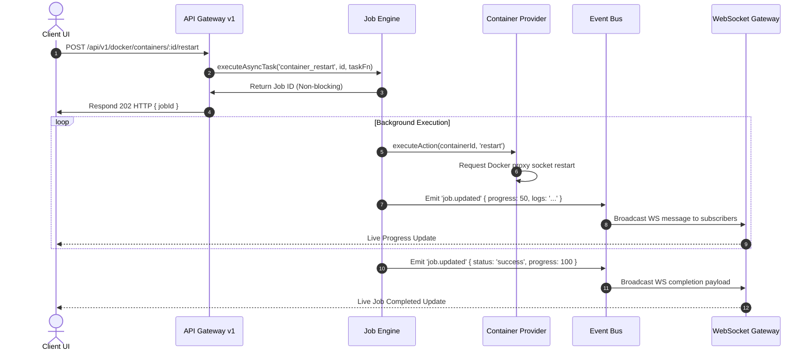

# HomeLab OS System Architecture Specification

This document details the system design, communication protocols, database schema, remote desktop pipeline, hardware kernel input subsystem, and runtime execution models of the HomeLab OS platform.

---

## 1. Overall System Architecture

HomeLab OS employs a decoupled client-server architecture. The backend functions as a headless control plane exposing a Fastify REST API and WebSocket events gateway. The frontend is a single-page application (SPA) executing client-side dashboard renders without build-time bundle dependencies.

```mermaid
graph TD
    subgraph Client-Side (Frontend SPA)
        UI[Dashboard Canvas] --> WM[Widget Manager]
        UI --> WS_C[WS Client]
        UI --> API_C[HTTP API Client]
        UI --> RTC_C[WebRTC Stream Player]
    end

    subgraph Server-Side (Backend Daemon)
        API_C --> REST[Fastify REST Router]
        WS_C --> WS_G[WebSocket Gateway]
        RTC_C <--> WS_D[Desktop Signaling Bridge]
        
        REST --> REG[Service Registry]
        WS_G --> EB[Event Bus]
        REG --> EB
        
        REG --> DB[SQLite Adapter WAL]
        REG --> CP[Container Provider]
        REG --> JE[Job Engine]
        REG --> SCHED[Cron Scheduler]
        REG --> INFRA[Infrastructure Service]
    end

    subgraph Host Infrastructure & Kernel
        CP --> DSP[Docker Socket Proxy]
        INFRA --> CFT[Cloudflare Tunnel Ingress]
        WS_D <--> STR[Host Streamer Daemon]
        STR --> UINPUT[/dev/uinput Kernel Input]
        STR --> DRM[Linear Framebuffers & DRM]
    end
    
    classDef default fill:#1e293b,stroke:#475569,stroke-width:1px,color:#fff;
```

---

## 2. Directory Structure

```
HomeLab/
├── .github/                  # GitHub Actions and community workflows
├── configs/                  # Shared system configuration files
├── backups/                  # Local backup archives (Git-ignored)
├── logs/                     # Operational log files (Git-ignored)
├── templates/                # Docker Compose template files
├── scripts/                  # Deployment, backup, and health utilities
├── services/                 # Auto-discovered plugin packages
│   └── <custom-service-name>/
│       ├── service.yaml      # Plugin manifest metadata
│       └── docker-compose.yml
├── docs/                     # Architectural and API specifications
│   ├── ARCHITECTURE.md       # Master system architecture (this file)
│   ├── API.md                # Exhaustive REST and WebSocket API specification
│   ├── REMOTE_DESKTOP.md     # Remote Desktop & /dev/uinput kernel input engine
│   ├── TOPOLOGY.md           # Container topologies & visual designer
│   ├── COMPONENTS.md         # Frontend components and widget framework
│   ├── PLUGIN_SDK.md         # Plugin manifest schemas and SDK hooks
│   ├── SERVICES.md           # Service catalog and logo resolution engine
│   └── ROADMAP.md            # Project development milestones
└── dashboard/
    ├── Dockerfile            # Multi-stage production container build
    ├── docker-compose.yml    # Control plane and socket proxy compose stack
    ├── frontend/             # Single-Page Application assets (HTML, CSS, JS ESM)
    │   ├── components/       # Core view web components
    │   ├── widgets/          # Modular dashboard widgets
    │   └── core/             # API and WebSocket client state managers
    └── backend/              # TypeScript server control plane
        ├── server.ts         # Fastify bootstrapper
        ├── src/
        │   ├── api/          # REST routes, WebSocket gateways, and streamer daemon
        │   ├── core/         # Core engine and dependency injection registry
        │   ├── database/     # SQLite adapters and repositories
        │   ├── docker/       # Socket proxy provider client
        │   ├── scheduler/    # Cron scheduling subsystem
        │   ├── terminal/     # Interactive pseudo-terminal engine
        │   └── utils/        # Paths, encryption, and logger utilities
        └── tsconfig.json
```

---

## 3. Core Subsystems

### 3.1 Service Registry (Dependency Injection)
The `ServiceRegistry` is a singleton container that initializes and binds all runtime singletons. This design isolates dependencies and prevents global instantiations of database and container clients:
- Bound Services: `ConfigService`, `DockerService` (with `ContainerProvider`), `InfrastructureService`, `MetricsService`, `NotificationService`, `WorkspaceService`, `CategoryService`, `PluginService`, `JobsService`, `AuthService`, `BackupService`.

### 3.2 Job Execution Engine
Long-running operations (such as container restarts, volume pull updates, and database backups) execute asynchronously inside the `JobsService` queue. This prevents blocking standard HTTP request-response cycles:
- **States:** `pending` $\rightarrow$ `running` $\rightarrow$ `success` | `failed`.
- **Streams:** Running jobs stream execution log buffers (`job.logs`) and progress metrics (`job.progress`) to the client over WebSocket event channels.

### 3.3 Event Bus & WebSocket Gateway
A centralized NodeJS `EventEmitter` routes runtime updates:
- **Publishers:** Container state changes, metrics collections, job updates, and newly logged alerts write directly to the Event Bus.
- **Subscribers:** The WebSocket Gateway listens to the Event Bus and broadcasts events to active clients based on their active channel subscriptions (`metrics`, `services`, `events`, `jobs`).

### 3.4 Remote Desktop & Streaming Engine
HomeLab OS features a browser-based Remote Desktop stream powered by WebRTC and hardware kernel input synthesis:
- **Display Grabber:** Multi-tier capture fallback supporting GNOME D-Bus Screencast, Wayland `grim`, MIT-SHM (`mss`), Linux kernel linear framebuffers (`/dev/fb0`), and PyAutoGUI.
- **WebRTC Pipeline:** Low-latency H.264 video track stream with synchronized presentation timestamps.
- **Hardware Kernel Input (`/dev/uinput`):** Direct injection of absolute mouse tablet events (`ABS_X`, `ABS_Y`) and full keyboard scancodes via the Linux kernel `uinput` module.
- For complete implementation details, see [REMOTE_DESKTOP.md](file:///D:/My_Projects/HomeLab/docs/REMOTE_DESKTOP.md).

### 3.5 Dynamic Container Topology Engine
The `InfrastructureService` dynamically constructs the logical and physical relationship graph of the homelab:
- Resolves the traffic hierarchy from the external internet, through Cloudflare Tunnels, across reverse proxy nodes, and into isolated container networks and volumes.
- For complete technical details, see [TOPOLOGY.md](file:///D:/My_Projects/HomeLab/docs/TOPOLOGY.md).

---

## 4. Request Lifecycle Sequence

The sequence below illustrates a client requesting an asynchronous container restart action:


```mermaid
sequenceDiagram
    autonumber
    actor User as Client UI
    participant Gateway as API Gateway v1
    participant Jobs as Job Engine
    participant Docker as Container Provider
    participant EB as Event Bus
    participant WS as WebSocket Gateway

    User->>Gateway: POST /api/v1/docker/containers/:id/restart
    Gateway->>Jobs: executeAsyncTask('container_restart', id, taskFn)
    Jobs->>Gateway: Return Job ID (Non-blocking)
    Gateway->>User: Respond 202 HTTP { jobId }
    
    loop Background Execution
        Jobs->>Docker: executeAction(containerId, 'restart')
        Docker->>Docker: Request Docker proxy socket restart
        Jobs->>EB: Emit 'job.updated' { progress: 50, logs: '...' }
        EB->>WS: Broadcast WS message to subscribers
        WS-->>User: Live Progress Update
    end
    
    Jobs->>EB: Emit 'job.updated' { status: 'success', progress: 100 }
    EB->>WS: Broadcast WS completion payload
    WS-->>User: Live Job Completed Update
```

---

## 5. Database Schema Overview

The database uses SQLite with Write-Ahead Logging (WAL) enabled for high concurrent throughput:

- **`users`:** Accounts, display names, avatars, roles (`admin`, `editor`, `viewer`), and salted-scrypt password hashes.
- **`servers`:** Target nodes catalog to support multi-server clustering.
- **`workspaces` / `categories` / `widgets`:** Custom layout parameters scoped per workspace and canvas grid positions.
- **`settings`:** Centralized key-value system settings store (auth, SMTP, SSH, desktop, backups).
- **`service_cache` / `plugin_meta`:** Manifest specification caches and container state logs.
- **`jobs` / `audit_log` / `notifications`:** Runtime operational histories and security event trails.

---

## 6. Security Sandboxing & Isolation

- **Docker Socket Proxy:** Only `CONTAINERS`, `IMAGES`, `POST` (for container lifecycles), and `INFO` APIs are exposed to the control plane. Destructive primitives (such as `EXEC` or host filesystem mounts) are disabled at the proxy layer.
- **Terminal Sandboxing:** The pseudo-terminal shell (`TerminalEngine`) resolves input statements against a virtual command routing switch, preventing command and shell injection vulnerabilities.
- **RFC 3207 STARTTLS 2FA:** Two-factor authentication verification via mandatory 3-step challenge flow (Password $\rightarrow$ Email Confirmation $\rightarrow$ 6-Digit OTP) with TLS socket upgrades.
- **Database Parameterization:** SQL repositories utilize query parameters exclusively to eliminate SQL injection threat vectors.
- **Secrets Separation:** Cryptographic keys (such as `JWT_SECRET`) must be supplied via environment variables. The server will refuse to boot in production mode if required variables are missing.
