# HomeLab OS Frontend Component & Dynamic Widget Architecture

This document describes the design system, Single-Page Application (SPA) architecture, custom web components, and modular widget ecosystem powering the HomeLab OS console.

---

## 1. Single-Page Application (SPA) Architecture

The HomeLab OS frontend is crafted in modern, lightweight Vanilla JavaScript (ES Modules) and pure CSS variables without bulky runtime frameworks.

### 1.1 Core Principles
- **Zero Build Step Frontend**: Browser-native ES Modules (`import`/`export`) load directly without webpack or vite bundles, enabling instant UI updates.
- **Strict CSS Custom Properties**: All styles, spacing tokens, and color gamuts are managed through standardized CSS variables in `style.css`.
- **Reactive WebSocket Integration**: A singleton `WebSocketClient` maintains persistent event channels for live metrics, logs, jobs, and desktop streaming.

```mermaid
graph TD
    App[app.js Master Controller] --> State[state.js Global Store]
    App --> WS[ws-client.js WebSocket Engine]
    App --> API[api.js REST Client]
    
    App --> H[header.js Header & Search]
    App --> SB[sidebar.js Navigation]
    App --> NC[notification-center.js Alerts Drawer]
    App --> CP[command-palette.js Quick Actions]
    
    App --> C_DASH[widget-grid.js Dashboard View]
    App --> C_CONT[app-containers.js Container Registry]
    App --> C_TOP[app-designer.js Visual Topology]
    App --> C_HLT[app-health.js Health Monitor]
    App --> C_JOB[app-jobs.js Job Center]
    App --> C_TERM[app-terminal.js Console Shell]
    App --> C_DSK[app-desktop.js Remote Desktop]
    App --> C_SET[app-settings.js Settings Manager]
```



---

## 2. Core Application Web Components

Each primary navigation view is encapsulated in a dedicated component module under `dashboard/frontend/components/`:

| Component File | View Route | Key Capabilities |
| :--- | :--- | :--- |
| `widget-grid.js` | `dashboard` | Dynamic grid layout management, drag-and-drop widget repositioning, responsive tile scaling. |
| `app-containers.js` | `containers` | Real-time container cards, status indicators, start/stop/restart actions, inline logs modal. |
| `app-designer.js` | `designer` | Interactive SVG/HTML5 canvas for topology visualization, node dragging, and compose deployment. |
| `app-health.js` | `health` | Subsystem availability cards (database, docker, tunnel, scheduler) and latency measurements. |
| `app-jobs.js` | `jobs` | Asynchronous task execution monitoring, live progress bars, log buffers, and cancellation triggers. |
| `app-terminal.js` | `terminal` | High-fidelity terminal console with inline cursor focus, command history, and direct SSH execution. |
| `app-desktop.js` | `desktop` | WebRTC video streamer canvas, direct mouse/keyboard capture, resolution scaling, and telemetry HUD. |
| `app-settings.js` | `settings` | System preferences manager, 2FA setup, SMTP STARTTLS configuration, SSH keys, and backups. |
| `header.js` | Global | Host status indicator, global search bar (`Ctrl+K`), quick stats summary, and user profile drawer. |
| `sidebar.js` | Global | Collapsible navigation menu, view switcher, and active route highlights. |
| `notification-center.js` | Global | Slide-out drawer displaying real-time system alerts, error logs, and task notifications. |
| `command-palette.js` | Global | Keyboard-driven command runner for instant navigation and service actions. |

---

## 3. Dynamic Widget Architecture

Widgets are modular UI blocks loaded into the dashboard canvas. Each widget implements the 7-method lifecycle contract:

```javascript
export default {
  id: 'widget-identifier',
  title: 'Widget Name',
  icon: 'cpu',
  supportedSizes: ['1x1', '2x1', '2x2'],
  wsEvents: ['system.metrics'],

  initialize() {
    // 1. Memory instantiation & state allocation
  },

  async render(container) {
    // 2. Initial HTML/DOM injection
  },

  update(container, eventData) {
    // 3. Reactive updates on WebSocket event arrival
  },

  resize(container, newSize) {
    // 4. Responsive canvas/chart dimension adjustments
  },

  destroy(container) {
    // 5. Cleanup event listeners & timers on removal
  },

  subscribe() {
    // 6. Connect to WebSocket event bus
  },

  unsubscribe() {
    // 7. Disconnect from WebSocket event bus
  }
};
```

### 3.1 Built-in Widgets
1. **CPU Utilization (`cpu.js`)**: Real-time gauge and load average sparkline.
2. **RAM Allocation (`ram.js`)**: Memory consumption breakdown (used, cached, free).
3. **Storage Usage (`disk.js`)**: Root and mounted volume capacity meters.
4. **GPU Status (`gpu.js`)**: NVIDIA/AMD graphics engine utilization and temperature.
5. **Ingress & Latency (`ingress.js`)**: Cloudflare Tunnel status and measured public latency.
6. **Services Grid (`services.js`)**: Quick-launch tiles with dynamic WebP logo resolution.
7. **Mini Terminal (`terminal.js`)**: Compact CLI shell directly inside the dashboard grid.
8. **Recent Events (`events.js`)**: Audit log stream of recent system modifications.

---

## 4. Logo Resolution & Auto-Brightness Engine

To maintain high visual fidelity across light and dark theme variations, `services.js` incorporates an in-browser luminance analyzer:

1. **CDN WebP Mapping**: Maps container names to high-resolution `.webp` icons from the jsDelivr `selfh.st/icons` library.
2. **Canvas Luminance Inspection**:
   - When an icon loads, an in-memory 8x8 pixel `canvas` calculates the average RGB luminance.
   - If relative brightness is $< 130$ out of 255, the image source automatically upgrades to the light-theme variant (`<name>-light.webp`).
3. **Vector SVG Fallback**: If an external icon fails to load, `onerror` automatically swaps in a crisp, local vector SVG placeholder.
