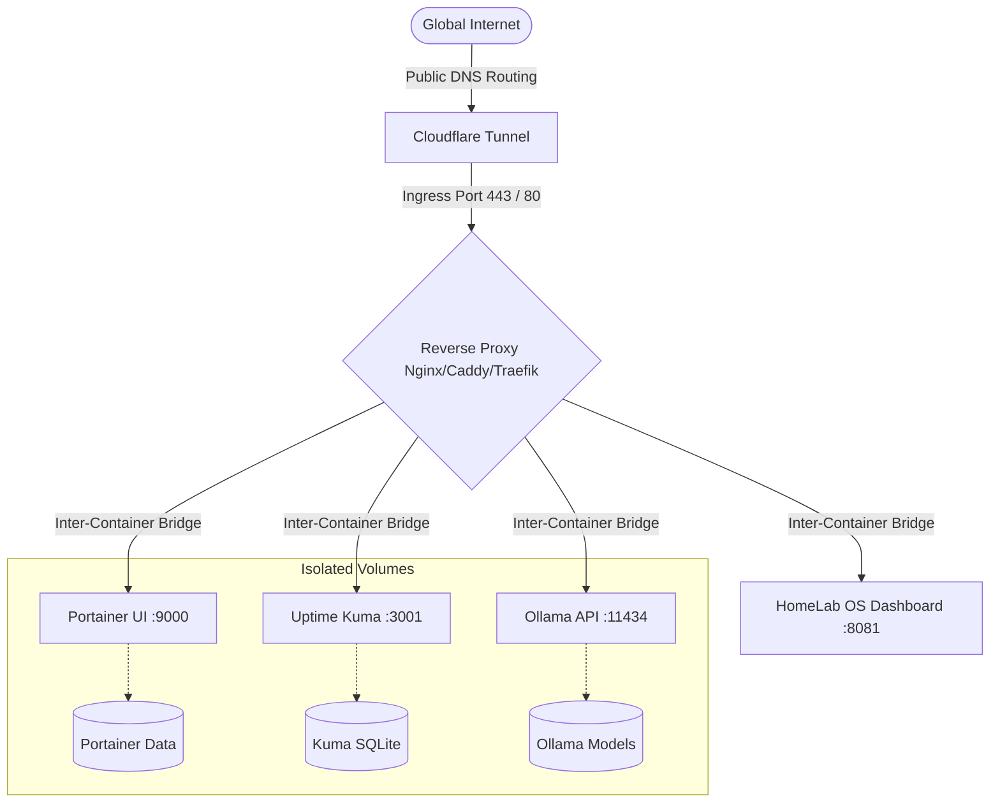

# HomeLab OS Container Topologies and Visual Infrastructure Designer

This document describes how HomeLab OS models, auto-discovers, renders, and provisions multi-container infrastructure topologies.

---

## 1. Dynamic Topology Auto-Discovery Engine

HomeLab OS dynamically maps the physical and logical relationships of your homelab infrastructure. The topology engine (`infrastructure.service.ts`) executes dynamic graph analysis by querying the Docker Socket Proxy and Cloudflare Tunnel configurations.



### 1.1 Ingress Hierarchy Resolution
1. **Internet Gateway**: The root root node representing incoming external internet traffic.
2. **Cloudflare Tunnel (`cloudflared`)**:
   - Status is determined dynamically by verifying `cloudflared` process execution in `/host/proc` or container state via Docker API.
   - Evaluates active ingress rules defined in `~/.cloudflared/config.yml`.
3. **Reverse Proxy Node Detection**:
   - Inspects running container names for proxy signatures (`proxy`, `nginx`, `caddy`, `traefik`), excluding internal socket proxies (`homelab-docker-proxy`).
   - If an edge reverse proxy container is running, the topology routes traffic through the proxy node before dispatching to application containers.
   - If no dedicated reverse proxy exists, routes link directly from the Cloudflare Tunnel ingress layer to target containers.
4. **Application Container Nodes**:
   - Queries Docker container state (`running`, `exited`, `paused`).
   - Merges container metadata with parsed `service.yaml` plugin capabilities.
   - Automatically positions nodes across dynamic X/Y coordinate planes.

---

## 2. Dynamic Visual Layout & Persistence

The Infrastructure Designer interface allows administrators to freely reposition container nodes, network bridges, and volumes on an interactive drag-and-drop HTML5 canvas.

### 2.1 Coordinate Persistence
Canvas coordinates are serialized as JSON and persisted in the SQLite database via the `designer.layout` settings key:
```json
{
  "internet": { "x": 400, "y": 50 },
  "cloudflared": { "x": 400, "y": 150 },
  "proxy": { "x": 400, "y": 250 },
  "portainer": { "x": 100, "y": 430 },
  "uptime-kuma": { "x": 260, "y": 430 },
  "ollama": { "x": 420, "y": 430 }
}
```
When `GET /api/v1/designer/topology` is called, the server merges runtime node discovery with the user's custom layout coordinates.

### 2.2 Live Data Flow Animation
The frontend topology renderer features dynamic SVG bezier connection lines:
- **Status Indicators**: Running nodes are highlighted in green, inactive nodes in amber/gray, and failed nodes in red.
- **Dynamic Search Highlighting**: When using global search (`Ctrl+K`), matching container nodes and their upstream path to the internet animate with blue glowing flow pulses.

---

## 3. Visual Canvas to Docker Compose Compiler

Administrators can design new container stacks visually in the Designer canvas. The deployment compiler (`POST /api/v1/designer/deploy`) transforms the visual graph into a standards-compliant Docker Compose YAML file.

### 3.1 Compilation Algorithm
1. **Container Extraction**: Filters canvas nodes of type `container` and generates service definitions with image names, restart policies, and published port bindings.
2. **Network Resolution**: Iterates through link connections between containers and `network` nodes, adding bridge networks to service descriptors.
3. **Volume Binding**: Resolves connections to `volume` nodes and maps persistent storage paths (e.g. `<volume_name>:/data`).
4. **File Generation**: Writes the generated `docker-compose.yml` to `services/custom-stack/docker-compose.yml`.
5. **Execution**: Dispatches an asynchronous deployment job to pull images and bring up the container stack via Docker Compose.
